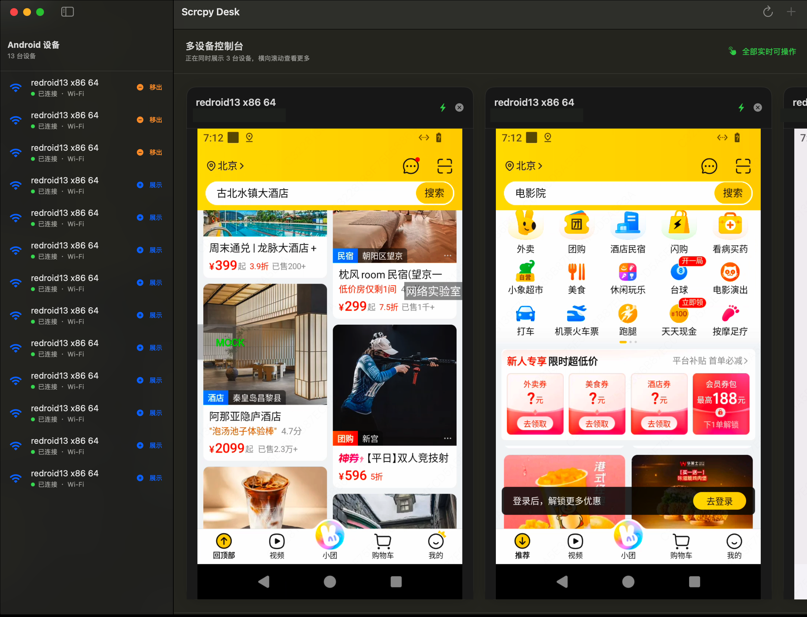

# Scrcpy Desk for macOS

> [官方网站](https://joker311223.github.io/scrcpy/) · [下载 v0.4.5](https://github.com/Joker311223/scrcpy/releases/download/scrcpy-desk-v0.4.5/Scrcpy-Desk-v0.4.5-macOS-arm64.zip) · [Release 说明](https://github.com/Joker311223/scrcpy/releases/tag/scrcpy-desk-v0.4.5) · [网站源码](../../../docs/) · [上游 scrcpy](https://github.com/Genymobile/scrcpy)

`Scrcpy Desk` 是基于 scrcpy 开发的 macOS SwiftUI 多设备控制台：

- 自动发现并展示 USB / Wi-Fi ADB 设备；
- 通过 IP 和端口执行 `adb connect`；
- 支持 Android 11+ 的 `adb pair` 无线配对；
- 可将任意数量的已连接设备加入右侧展示，并通过常驻横向滚动条查看；
- 每台设备都拥有独立的低延迟 scrcpy 实时会话，可以同时操作；
- 每张设备卡片按实时视频宽高比自动适配宽度，横竖屏切换时同步更新；
- 鼠标触控、滚动、键盘、快捷键、剪贴板和音频均由原 scrcpy 客户端处理；
- 支持按设备保存备注名和页面跳链，并通过 VIEW Intent 一键加载页面；
- 支持直接选择 APK 并安装到指定设备；
- 弹窗、横向滚动和卡片重排时保持画面，Metal 渲染异常时自动恢复对应会话；
- 主窗口支持一键置顶，设备渲染面与弹窗层级始终同步；
- 不创建或唤起独立的 scrcpy 窗口。



## 环境

- macOS 13 或更高版本；
- Swift 5.10 或更高版本；
- ADB（构建脚本会将当前 PATH 中的 `adb` 复制进 App）。

构建脚本会在打包前检查 CMake、Meson、Ninja、NASM 和 pkg-config，缺少时通过 Homebrew 自动安装；FFmpeg、SDL3 与 dav1d 会按 macOS 13 目标从源码构建并内置到 App。发布后的 App 已包含这些运行依赖，使用者无需安装 Homebrew、FFmpeg 或 SDL3。

## 开发运行

```bash
./gradlew -p server assembleRelease
swift run ScrcpyDesk
```

## 构建 App

```bash
desktop/macos/ScrcpyDesk/build_app.sh
open "desktop/macos/ScrcpyDesk/dist/Scrcpy Desk.app"
```

也可传入自定义输出目录：

```bash
desktop/macos/ScrcpyDesk/build_app.sh /tmp/scrcpy-desk
```

## 连接设备

USB 设备只需启用开发者选项和 USB 调试，连接后会自动出现在左侧。

已有 ADB TCP/IP 地址时，点击“添加设备”，填写 IP 和连接端口（传统模式一般为 `5555`）。Android 11+ 首次使用无线调试时，打开“首次无线配对”，使用手机弹窗中显示的配对端口和六位配对码完成配对，再填写无线调试页显示的连接端口进行连接。

## 多设备展示

每个已连接设备在左侧都有“展示”按钮。加入展示后，右侧会为该设备创建独立 scrcpy 会话；卡片会读取设备当前视频分辨率并按真实宽高比自动调整宽度，横竖屏切换或窗口高度变化时同步更新，不会被压缩、拉伸或留下左右黑边。横屏设备会自然变宽，并继续通过横向滚动查看。

仍可拖动卡片右侧把手手动调整宽度；双击把手会清除手动值并恢复自动宽度。

点击设备卡片右上角的关闭按钮只会将其移出展示并结束对应会话，不会断开 ADB。需要断开网络设备时，可在左侧设备上点击右键并选择“断开连接”。

设备画面在添加设备、重命名、配置跳链等弹窗出现时仍会继续显示；滚动、调整卡片宽度或移除相邻设备时，渲染窗口会持续跟随对应卡片。若 Metal 表面或网络会话暂时失效，应用会优先恢复最后一帧，并仅重启异常设备的独立会话。

## 窗口置顶

点击主窗口右上角的图钉按钮，可以在普通窗口与始终置顶之间切换。开启后按钮高亮，选择会自动保存；所有设备渲染面会与主窗口同步层级，Sheet、Alert 等弹窗仍显示在设备画面上方。

## 安装 APK

点击设备卡片顶部的安装按钮并选择 `.apk` 文件，应用会对当前设备执行等价于以下命令的安装：

```bash
adb -s <设备序列号> install -r <APK 文件>
```

每台设备独立显示安装状态，安装操作不会影响其他正在预览和操作的设备。

## 设备备注与页面跳链

在左侧设备上点击右键，可以修改设备备注名或配置该设备专属的页面跳链。配置完成后，点击右侧预览卡片上的页面加载按钮，会执行等价于以下命令的 ADB 调用：

```bash
adb -s <设备序列号> shell am start \
  -a android.intent.action.VIEW \
  -d "<配置的 URL>"
```

跳链以独立进程参数传递，支持 HTTP(S) 地址、自定义 Scheme 和查询参数；备注名、跳链及展示状态均按设备序列号持久保存。

## 嵌入实现

App 与 scrcpy C 客户端被编译进同一个进程。每个已展示设备都有独立的会话与无边框子渲染面，绑定在 SwiftUI 主窗口的对应卡片上；SDL3 只管理这些渲染面，不会创建独立应用窗口，也不会改变主界面布局。scrcpy 的服务端、视频解码器、音频播放器、输入管理器和控制通道保持不变；共享事件队列由 macOS 主事件循环驱动，AppKit 的鼠标、滚轮、键盘和输入法事件则按设备显式转发到正确会话。
